こんにちは、えむです！<br>
久しぶりにGatsbyで作成した自作ブログに関連する記事を書こうと思います。<br>

なんのこと？と思った方はよければ、以下の記事を読んでみてください。<br>

[Gatsbyを使ってブログ作成を始める方法](https://emuism.netlify.app/gatsby-blog-setup/)

今回はGatsbyプロジェクトを一般公開するまでの流れを書いていきます。<br>
では、早速やっていきましょう！<br>
## Gatsbyで作成したブログを公開するまでの流れ
公開までの大まかな流れは以下のようになります。<br>
1. GitHubにリモートリポジトリを作成
2. Gatsbyで作成したプロジェクトをGitHub上のリモートリポジトリにpushする
3. NetlifyでGitHubのリポジトリを紐づける
<br>
たったのこれだけです！<br>
<br>
一度、NetlifyとGitHubを紐付けでしまえば、あとはローカルで作成しているプロジェクトに変更があったときに、その変更をコミットしてpushするだけでブログを更新することができるようになります。<br>
めちゃくちゃ簡単！<br>
<br>
では、具体的な手順を説明していきます。<br>
<br>

### 1.GitHubにリモートリポジトリを作成
まずはGitHubにリモートリポジトリを作成します。<br>
もし、GitHubのアカウントを持っていなければ、アカウント作成から始めます。<br>

[Join Github](https://github.com/join)から手順にしたがってアカウントを作成します。<br>

アカウントが作成できたら[Sin in to Github](https://github.com/login)からサインインします。<br>
サインインすると以下のような画面になります。<br>
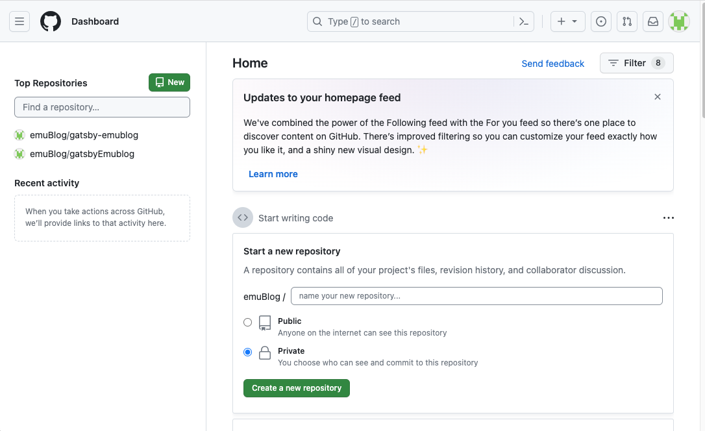<br>
右上の＋ボタンを押し、
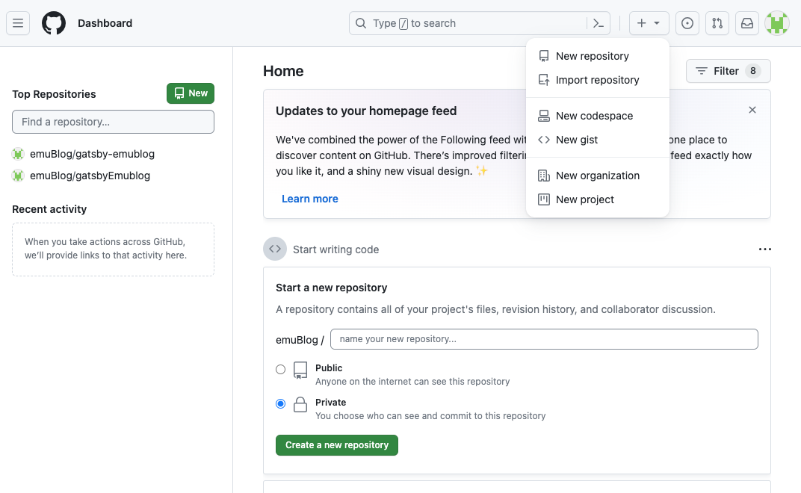<br>
`New repository`をクリックします。<br>
<br>
以下のような画面になるので、とりあえず、`Repository name`を入力するのと、`Public`と`Private`のどちらかを選択すれば、最低限大丈夫です。<br>
リモートリポジトリを公開する場合は、`Public`、しない場合は`Private`を選択します。<br>
<br>
入力したら、`Create repository`を選択します。<br>
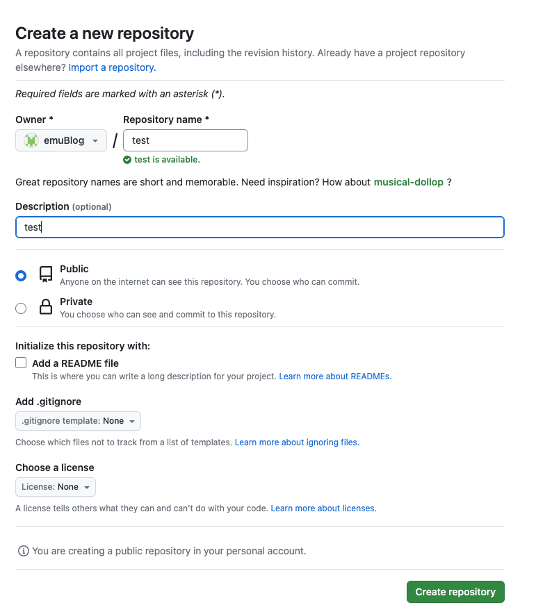<br>
すると、以下のような画面になります。<br>
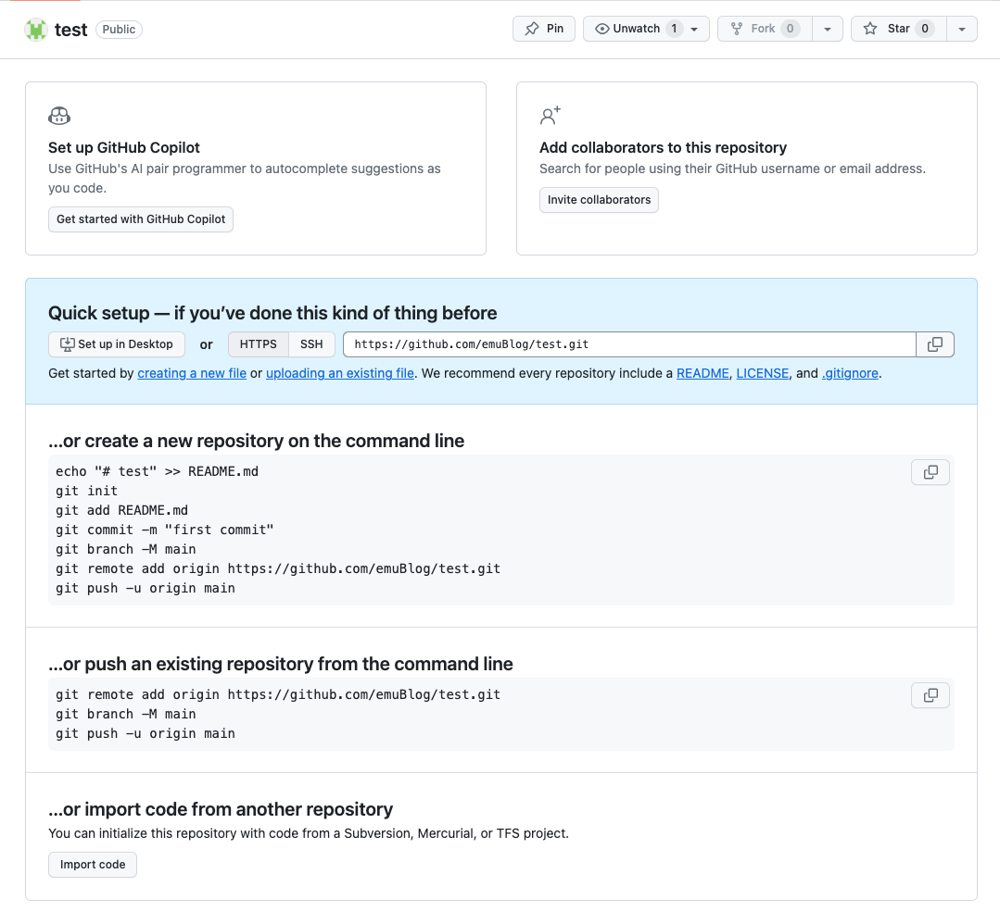<br>
これでGitHubにリモートリポジトリを作成することができました。<br>
<br>

### 2.Gatsbyで作成したプロジェクトを作成したリポジトリにpushする
現時点でGitHub上のリモートリポジトリは作成したものの空っぽです。<br>
ですので、自分のPCにローカルリポジトリを作成し、そこにリモートリポジトリを紐づけます。<br>
そして、pushすることでローカルで作成したプロジェクトをGitHub上のリモートリポジトリに反映させることができます。<br>
<br>
まず、ターミナルを開いて`cd`コマンドを使って、作成したGatsbyプロジェクトのディレクトリに移動します。<br>
移動ができたら、以下のコマンドを実行します。<br>
```
git init
```
これで、そのディレクトリの中にローカルリポジトリができました。<br>
<br>
次に、そのディレクトリの中でローカルリポジトリに反映させたいファイルを選択します。<br>
以下のように`add`コマンドを実行します。<br>
```
git add 反映させたいファイル名
```
ディレクトリの中のファイル全てを反映させたい場合は、以下のようにします。`.`はカレントディレクトリの中の全てのファイルを指しています。<br>
```
git add .
```
`git add`で選択されたファイルは、ステージングエリアというものに追加されます。<br>
ステージングエリアに追加されたファイルはトラッキングされ、変更点があったときにそれが把握できるようになります。<br>
<br>
しかし、これだけではローカルリポジトリに反映はされません。<br>
コミットすることで、ローカルリポジトリに変更が反映されます。<br>
以下のコマンドでコミットできます。<br>
```
git commit -m "first commit"
```
`-m`オプションはコミットに対して、コメントをするためのものです。<br>
<br>
`git`は誤ってコミットをしてしまった際に、前にコミットした段階まで戻れるようになっています。<br>
その時に、コミットした内容がわかるように`-m "コミットの内容"`としておくことで、便利にバージョン管理ができるわけですね。<br>
<br>
これで、ディレクトリの内容（今回はGatsbyのプロジェクト）をローカルリポジトリに反映させることができました。<br>
<br>
次にローカルリポジトリにリモートリポジトリを紐づけます。<br>
以下のコマンドで紐づけることができます。<br>
```
git remote add origin https://github.com/ユーザ名/リポジトリ名.git
```
`ユーザ名`にはGitHubのアカウント作成時に決めたユーザ名、`リポジトリ名`にはリモートリポジトリ作成時の名前が入ります。<br>
このコマンドはoriginという名前でリモートリポジトリをローカルリポジトリに登録する、ということを行っています。<br>
これは、登録するだけなので最初に1回だけ行えば大丈夫です。<br>
もしかしたら、このコマンドの実行時にユーザ名とパスワードを求められるかもしれません。<br>
（パスワードは、アカウント作成時のものではなく、別で設定が必要なものだった気がします。<br>
ちょっと今覚えてないので、思い出したら記載します。）<br>
<br>
そして、最後に`push`をします。<br>
以下のコマンドを実行します。<br>
```
git push -u origin main
```
この後、GitHubで作成したリモートリポジトリの中身を見ると、ローカルリポジトリの中身が反映されているはずです。<br>
<br>
以降、ローカルリポジトリ内のファイルに変更があった場合は、基本的には以下のコマンドを実行すれば大丈夫です。<br>
```
git add .
git commit -m "コミット内容"
git push -u origin main
```
<br>

### 3.NetlifyでGitHubのリポジトリを紐づける
次に、Netlifyのアカウントを作成し、GitHubのリモートリポジトリを紐づけます。<br>
<br>
まずは、[Netlify公式サイト](https://www.netlify.com/)から右上のSign Upをクリックします。<br>
すると、以下のような画面が出てきます。<br>
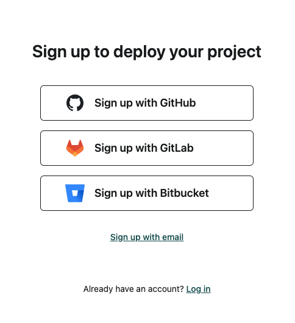<br>
<br>
この画面のSign up with Githubを選択して、Sign upを行います。<br>
Sign upが完了し、ログインできたら以下のような画面になります。<br>
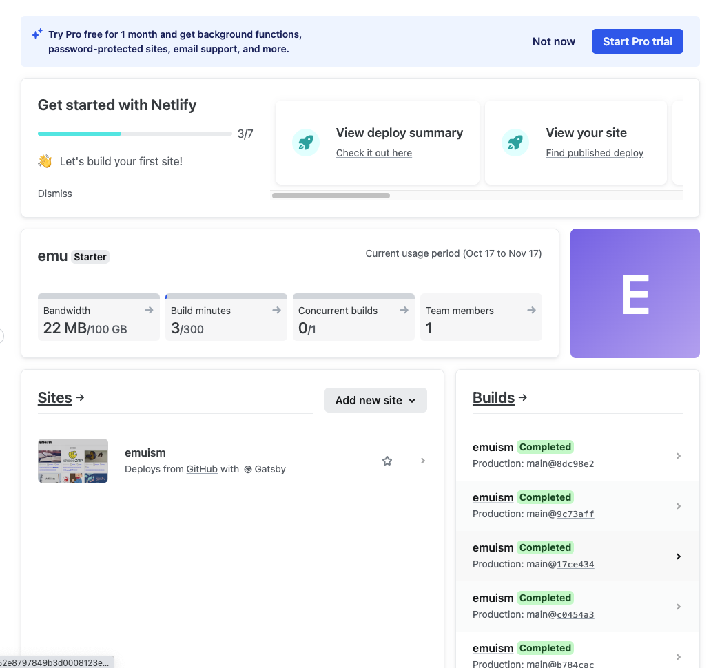<br>
連携が完了すると、Sitesのところに登録されたものが表示されるようになります。<br>
僕の場合はすでに連携が済んでいるので、表示されていますね。<br>
<br>
Add new siteのボタンを押し、Import an existing projectを選択します。<br>
すると以下の画面になります。<br>
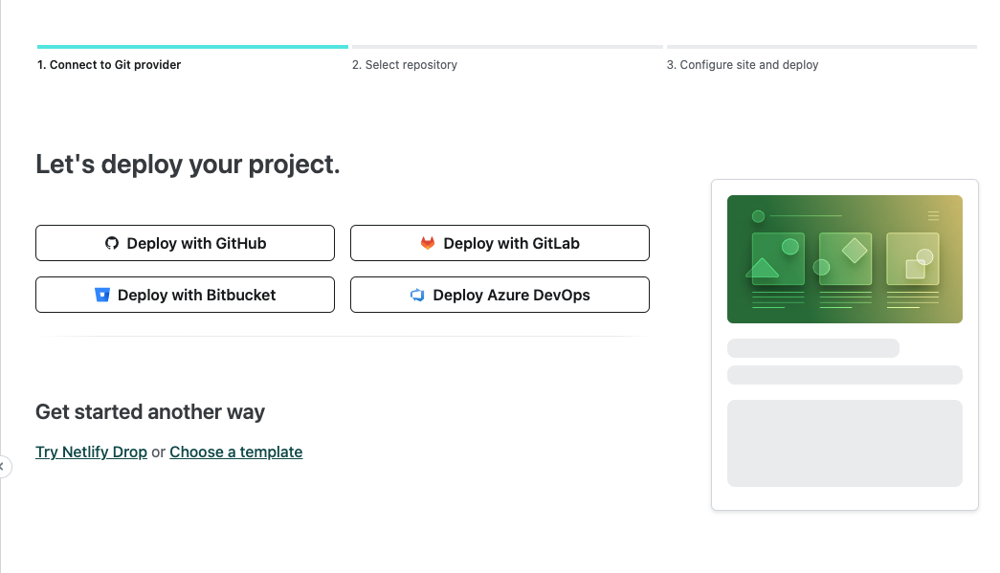<br>
Deploy with GitHubをクリックします。<br>
すると以下のように、GitHub上のリモートリポジトリが表示されます。<br>
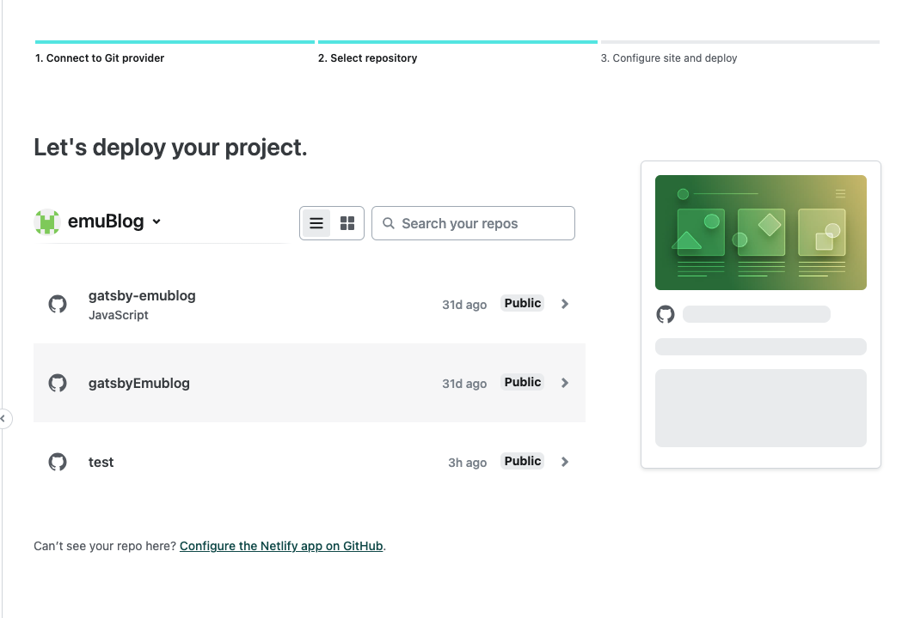<br>
ここで、連携させたいリポジトリ（今回はGatsbyプロジェクトのやつ）を選択します。<br>
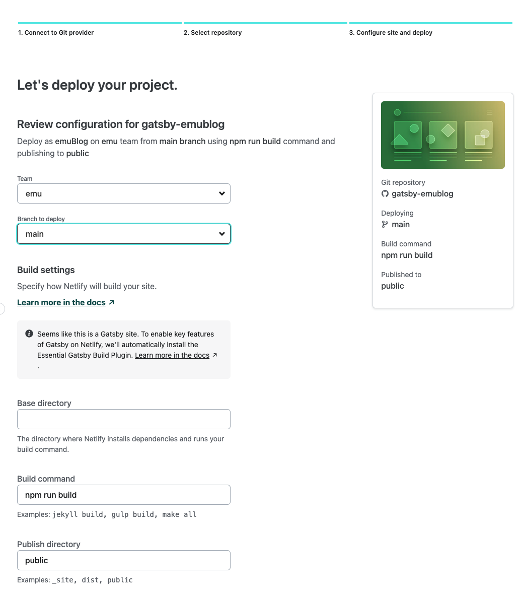<br>
↓続き<br>
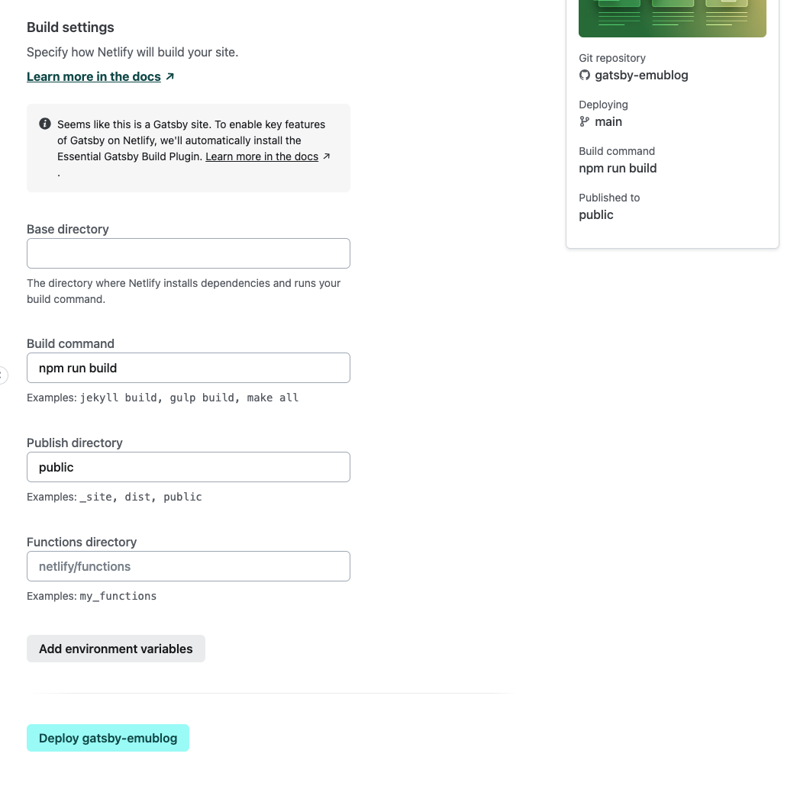<br>
特に設定せず、`Deploy リポジトリ名`ボタンをクリックして大丈夫です。<br>
すると、以下のように自動でデプロイが始まります（少し時間がかかります）。<br>
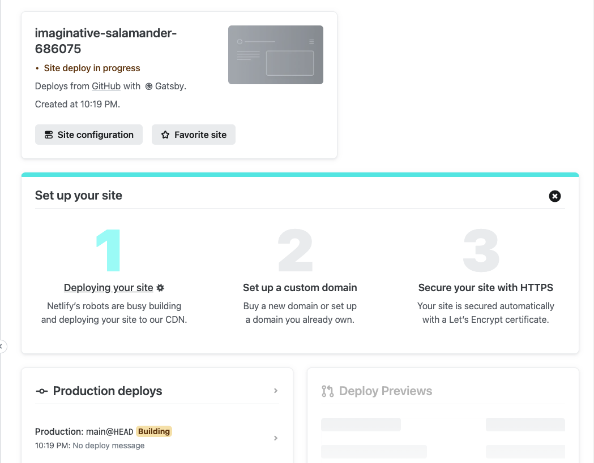<br>
デプロイが完了すれば、以下の赤枠にURLが表示されます。<br>
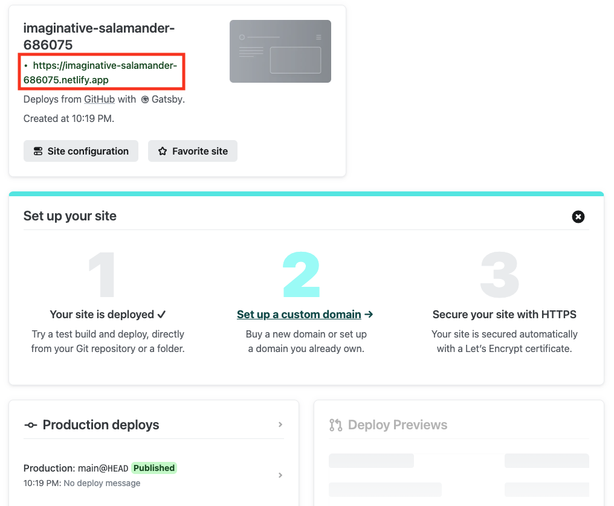<br>
このURLをクリックし、Gatsbyで作成したブログが表示されれば、一般公開が完了となります！<br>
以降、GitHubに`push`されるたび、自動でデプロイし直してくれます。(URLカスタムできるので、後日そのやり方も追記しますね)<br>
<br>
お疲れ様でした！<br>
<br>
<br>
＊この画像のURLは一時的に、このemuismと同じものを元に作成したもので、すぐに削除するのでアクセスはできないと思います。<br>

## まとめ
今回はGatsbyで作成したブログを、Netlifyというサービスを使って一般公開する方法を紹介しました。<br>
一度、連携させてしまえば特にやることもなく、ブログの更新ができます。<br>
とはいえ、無料版なので色々制限があった気がするので、また今度その辺も調べてみようかなと思います。<br>
<br>
まだまだ、このサイトもやれることがいっぱいあると思いますし、一緒に頑張りましょう〜！<br>
<br>
ではでは〜〜
