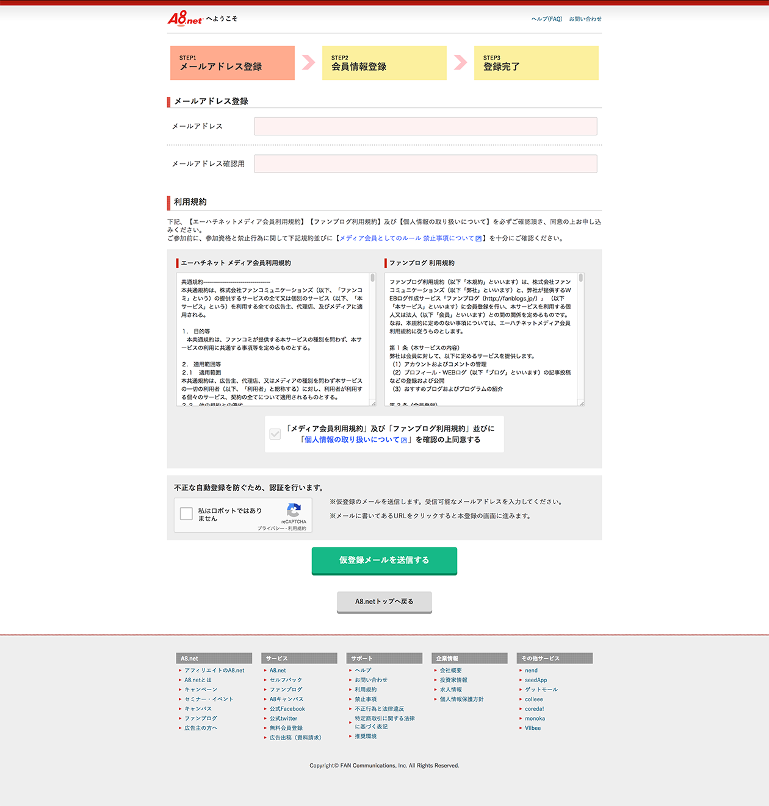
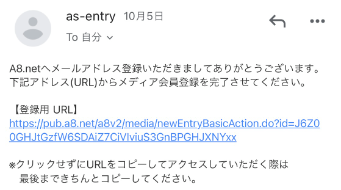
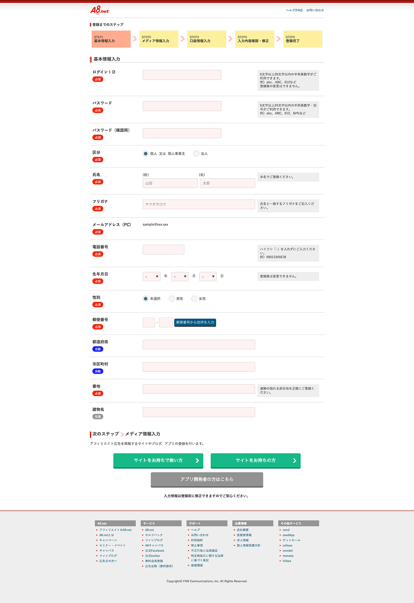
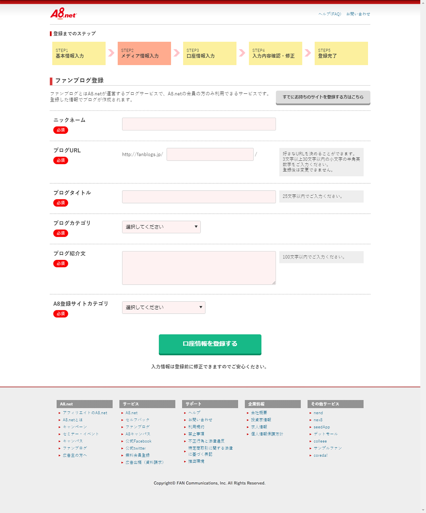
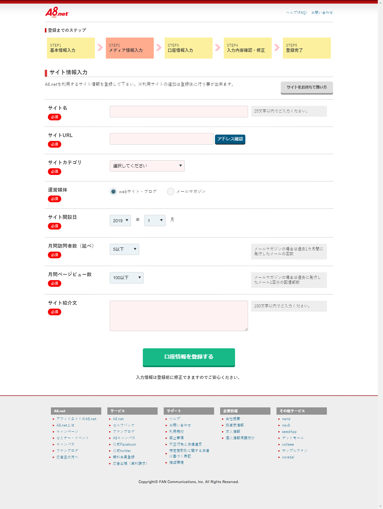
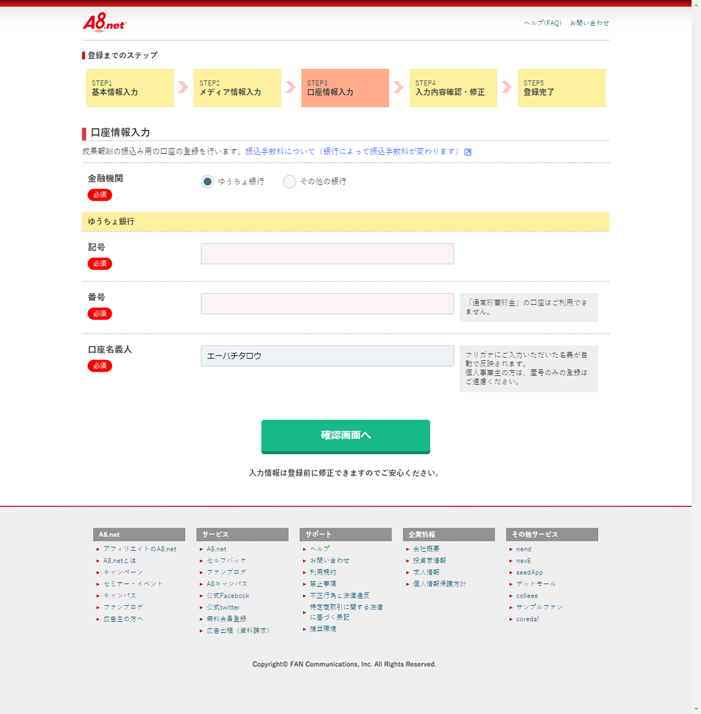
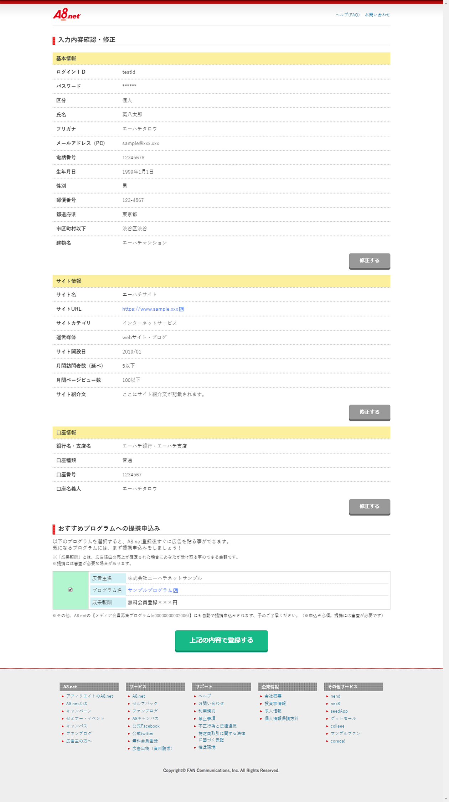
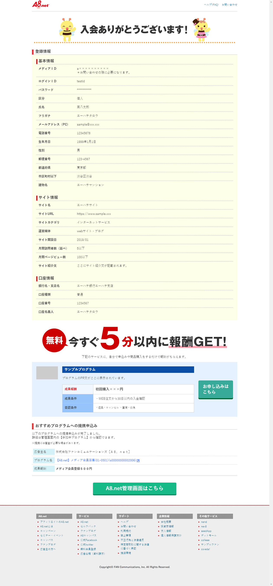

こんにちは、えむです！ 

私ごとですが、Gatsbyを使ってブログの作成を始めてから、約１ヶ月半が経ちました。 
一番最初の記事で、ブログの収益化もいずれできたらいいなということを話しました。 
 
ブログの収益化といえば、一番真っ先に思いつくのはアフィリエイトだとと思います。 
アフィリエイトは成功報酬型広告のひとつで、自分のブログに広告を設置して、その広告から商品やサービスの購入があった場合に報酬が得られるという体系になっています。 
アフィリエイトを利用するには、ASP（アフィリエイトサービスプロバイダ）に登録する必要があります。 
しかし、多くのASPは審査が必要な場合が多く、ブログ初心者にはハードルが高いことが多いです。 
そんな中、審査を必要とせずに登録できるものがあります。 
 
それが **A8.net**というASPです。 

今回は、A8.netを使って初心者でも簡単にアフィリエイトを開始する方法をお伝えしたいと思います。

## A8.netへの登録方法
A8.netへの登録は非常に簡単です。 
まず、以下のリンクから登録を始めることができます。 

 
 
登録画面に遷移すると、以下のような画面になります。 
登録したいメールアドレスを入力してください。 
僕は管理がしやすいようにブログ関連で使う専用のメールアドレスを新規で作成したので、それを使って登録をしました。 
普段使いのメアドよりも、専用のメールアドレスを持っていた方が何かと便利かもしれません。 

 
メールアドレスを入力して「仮登録メールを送信する」ボタンを押すと、入力したメールアドレスに登録用のリンクが添付されたメールが届きます。 
 

 
登録用のリンクを押すと、以下のような画面になります。 
5つのステップで登録が完了します。とても簡単ですね。 
入力欄に基づいて情報を入力します。 
入力が完了したら、「サイトをお持ちでない方」、「サイトをお持ちの方」のどちらかのボタンを選択することができます。 

### 「サイトをお持ちでない方」を選択した場合
サイトを持っていない場合でも、A8.netのが運営するブログサービスに登録してすぐに始められるようです。 

### 「サイトをお持ちの方」を選択した場合
サイトを持っている場合はサイトのURL、紹介文などを入力します。 
URLはサイトのトップページに当たるもののリンクを入力しましょう。 

 
 
 
 
 
そして、最後に口座情報を入力して「確認画面へ」を押します。 

入力情報に誤りがないかを確認し、「上記の内容で登録する」を押します。

下の画面になったら登録完了です。

 
 
 
 
非常に簡単に登録できますので、興味を持ったら是非始めてみてはいかがでしょうか？ 
 

## 自分のサイトに広告を貼る
登録したら、プログラムを検索して提携申請をします。 
提携完了したらプログラム管理画面から、html形式の広告リンクを取得することができるので、それをサイトに貼り付ければOKです。 
非常に簡単に広告を貼ることができます。 

## まとめ
今回はアフィリエイトの中でも、手軽に始めることができるA8.netを紹介し、登録方法と広告の掲載方法について書いてみました。 
ブログ初心者からすると登録に審査が必要な場合は敷居が高いですし、利用できない状態が続くとモチベーション低下にもなりかねないので、すぐに始められるというのはそういう意味でもメリットが大きいと思います。 

しかし、収入を得られるのには時間がかかると思いますので、根気よく、そして何より楽しんでブログ運営を行いましょう。 

ではでは〜〜
