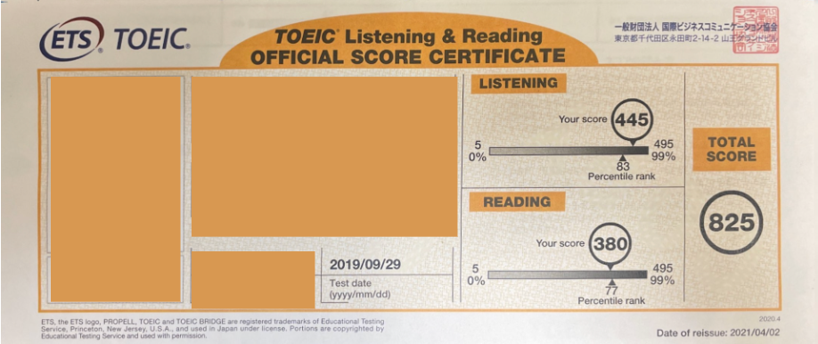

こんにちは、えむです！ 
 
この前、XでどうすればTOEICの点数を伸ばすことができますか？というポストを見かけました。 
自分も以前TOEICの勉強をしていたことがあったので、懐かしいなぁと思いながらも、もしかして自分が点数を上げることができた経緯は誰かの役に立つかもしれないと思い、本記事にまとめてみようと思います。 

## この記事が役に立つ可能性がある人
今回は英語が苦手だけど、何かしらの理由（進学・就活・仕事の昇進）でTOEIC(Listening&Reading Test)でそれなりの点数を取得する必要がある人向けになります。 
英会話のように実践的な力を身につけたい人にはあまり参考にならない可能性があります。そもそも、TOEIC(Listening&Reading Test)がそういう力を身につけるテストではないです。 
 
とはいえ、聞く力・読む力は確実に向上するので、無駄にはなりません。安心してください。
 
## 筆者のTOEICスコアの推移
この記事の内容がある程度は信用してもらえるように、僕のTOEICのスコア推移を紹介したいと思います。  
僕は小さい頃から英語を学んできたわけではなく、普通に英語が苦手な人間でした。 
実際、初めてTOEICを受験したときの点数は320点くらいだったと思います。 
こんな人間でも、最終的には825点までスコアを伸ばすことができました。 
一応証拠です。 
 

 
 
それ以降は英語の学習をあまりしなくなったので、今はこんなに点数取れないと思いますが、一時的にそれなりの点数を取る事は可能ということです。 
 
以下が825点に到達するまでの道のりです。感じです。 
|  |  |
| - | - |
|2017年9月受験|320点| 
|2017年11月|進学のため目標を600に定めて本格的に勉強を開始。| 
|2017年12月受験|410点| 
|2018年1月受験|580点| 
|2018年3月受験|640点| 
目標達成したので、一時中断 

|  |  |
| - | - |
|2019年 3月|大学院入試に向けて勉強再開| 
|2019年6月受験|640点| 
|2019年9月受験|825点| 

この変化を見れば分かれる通り、ちゃんと勉強すれば結果に反映されるのがTOEICです。 
 

## TOEICのテスト形式
まず、TOEICのテスト形式について振り返っておきましょう。 
Listening100問(45分)、Reading100問(75分)と問題数が多く、時間も長いのでなかなか体力のいるテストになっています。 
 
構成は以下の通りです。 
listening
* Part1：写真描写問題(6問)
* Part2：応答問題(25問)
* Part3：会話問題(39問)
* Part4：説明文問題(30問)
Reading
* Part5：短文穴埋め問題(30問)
* Part6：長文穴埋め問題(16問)
* Part7：文書問題(54問)

より、具体的な情報は[TOEIC公式サイト](https://www.iibc-global.org/toeic/test/lr/about/format.html)から確認してみてください。

## 効率的な勉強方法
これまでの自分の経験を踏まえて、効率的な勉強方法は以下の流れが良いと考えています。 
1. 単語・文法をひたすら覚える
2. 発音を学ぶ
3. リスニングの対策をする（シャドーイング）
4. 定期的に公式問題集を解いてアウトプットをする
 
1つ1つ詳細に書いてみます。 

### １．語彙力・文法をひたすら鍛える
どの言語においても一番大事なことですよね。 
実際、Part5は語彙力・文法に関する問題が出題されます。  
このPart5をいかに正確に素早く解けるかがReadingパートの点数を決めると言っても過言ではありません。 
そして、Part5はある程度傾向が掴みやすいので、点数アップしやすいPartになっています。 
ここを素早く解いて、Part6、Part7に使える時間を確保することがスコアアップを目指す上でかなり重要なポイントです。 
 
リスニングにおいても、知らない単語を聞き取るなんて不可能なので、語彙力を増やすことがまずは最優先と言えるでしょう。 

### ２．発音を学ぶ
ある程度、語彙力・文法が身に付いてきたら読み取りはもちろんのこと、聞き取りに関しても基礎的な能力が出来上がっていると思います。 
ですので、次の段階としては聞き取りができる耳を作ることが必要です。 
 
そこで活きるのが発音を学ぶことです。 
発音を学んで自分でも発音できるようになることは非常に重要ですが、これを蔑ろにしてしまっている人は少なくないと思います。 
僕自身も2019年の6月の受験を終えた後に発音を学びました。 
 
なんとなく、LとRの音ってこんな感じだよねっていう感覚だとあまり聞き取れるようになりません。 
ですが、舌の動き・息の使い方まで理解し、自分で正しく発音する方法を知ると、より単語を聞き分けられるようになります。 
また、TOEICの試験では聞き取りやすいように１単語１単語はっきりと発音してくれる事はありません。 
ネイティブスピーカーなのですらすらと読み上げます。 
 
すると、単語の最後が省略されたり、次の単語の頭の音とつなげて発音したりします。 
これをリンキングと言います。 
 
発音に理解がないと、このリンキングが起きているものを聞き取ることがかなり難しくなってしまいます。 
原稿を見ればそんなに難しくないのに、いざリスニングになると聞き取れなくなるのは、これが主な原因なんじゃないかなと思っています。 

### 3．リスニングの対策をする（シャドーイング）
発音を学んだら、本格的にリスニングの対策を始めてください。 
一番おすすめな方法はシャドーイングです。筆者はこれを繰り返すことで、リスニングの点数が飛躍的に上がりました。 
 
シャドーイングとは、聞こえた音声をそのまま読み上げるトレーニング方法になります。 
 
もちろん、いきなり聞いただけでそのまま発音するのはかなり難しいです。 
そこで、最初は原稿を見ながらで構いません。 
同じ音源でも構わないので、これを繰り返して慣れてきたら、原稿を見ずにシャドーイングに挑戦しましょう。 
僕は公式問題集のPart3、Part4の音源を使っていました。 
解答に原稿があるし、単語・文法の解説もあるので、Readingの対策にもつながります。 
 
ただ、読み上げるだけで良い、という訳ではありません。 
以下のポイントを意識して実践することが大切です。
* リンキングを意識する
* 文法を意識する
 
リンキングに関しては説明した通りです。 
文法に関してですが、具体的には、どこまでが主語か、動詞は何か、接続詞を使っているか、などを意識しながらシャドーイングして、瞬時に文章の構造を理解する、ということを癖づけてください。完璧にできなくでも大丈夫です。意識をすることが大切です。 
 
これを癖づけると、文章でもすぐに英文の構文を理解する力が身につくので、読む速度が上がります。 
結果的に、Part6やPart7の対策にもつながるというわけですね。 
 
シャドーイングは取り組むハードルが高い感じがしますが、その分効果がある方法ですので、ぜひ取り入れてみてください。 

### 4．定期的に公式問題集を解いてアウトプットをする
どんな試験においても、過去問や公式が出している問題集は役立ちます。 
傾向把握、自分の実力の確認のために絶対にやりましょう。 
 
ただ、公式問題集も闇雲に解いて終わり、にするのはかなり勿体無いです。 
 
公式問題集を解くときは以下の3つのポイントを意識することをお勧めします。
1. 時間配分を意識する
2. 本番と同じ感覚で解く
3. 解答後は解説を必ず読む

#### １.時間配分を意識する

テスト形式からわかるように、TOEICは長時間のテストです。 
Listeningでは時間配分は決まっているので気にしなくて良いですが、Readingは違います。 
このPartにはこれくらいの時間をかける、ということを事前に決めて取り組まないと普通に事故ります。 
なので公式問題集を解く際は時間を意識して、どのパートにどのくらい時間をかけるかを決める指標にしてください。 

特に、Part5にかける時間は絶対に決めておいてください。 
ただ、長文を読むのがまだ苦手で、そもそもPart6,Part7に時間をかけてもあまり点数が望めない場合は、Part5にかける時間を多めにして確実にスコアを取りに行った方がいいです。 
 
また、時間内に全ての問題を解ききるのはかなり難しいです。 
それに加えて、後半の問題が難しい傾向にあります。 
ですので、後ろの難しめの数問は、解かない前提で時間配分を決めることも時には大切です。 
 
公式問題集の結果を参考に、戦略を立てましょう。 

#### ２.本番と同じ感覚で解く
可能であれば、Partに分けて実施するのではなく、本番と同じように連続で全ての問題を解いてください。 
これは、集中力を維持する練習になります。 

また、今は勉強だから、とわからない問題に時間をかけることもやめてください。 
わからなそうだったら、きっぱり捨てるようにしてください。 
悩む事は大切ですがこれが癖づいてしまうと、本番で同じような場面になったときも、もやもやしたまま次の問題に行くことになるかもしれません。 
 
TOEICはメンタル勝負なところもあるので、こうしたもやもやがあるだけで点数をかなり落としてしまいます。 
筆者も、前半の問題がうまくいかず後半も集中できずに終わってしまったことがあります。 
 
以上のように、集中力やメンタルも本番を想像して取り組むことで有効に活用できます。 

#### ３.解答後は解説を必ず読む
公式問題集を解答した後、採点してスコアが出て終わりではありません。 
当たり前のことですが、分からなかった単語・文法は必ず復習してください。 
文章を覚えてしまうくらいやっても大丈夫です。 
それくらい、公式問題集の問題は価値があります。 
 
何年分も覚えるくらいやるに越した事はないです。 
それが難しい場合もあると思います。 
その場合、複数の公式問題集を中途半端に復習するよりは、1冊を完璧にする方が得点につながりやすいと思います。 
もちろん、何年分も覚えるくらいやった方がいいのは間違いないですが、あまり時間が確保できない方は、参考にしてください。 

## まとめ
今回は、僕の体験談を元にTOEICの効率的な学習方法についてまとめてみました。 
書いてて、あの時期は頑張っていたなぁと懐かしい気持ちになりました笑 
 
今回は勉強方法についてまとめてみましたが、次は実際に使ったテキストなどを紹介したいと思います。
 
TOEICはお金も時間もかかるし大変ですが、その分評価される場面も多いので、ぜひ高得点が取れるように頑張ってみてください。 
この記事があなたの勉強に役立つことを願っています！！！
  
ではでは〜〜
