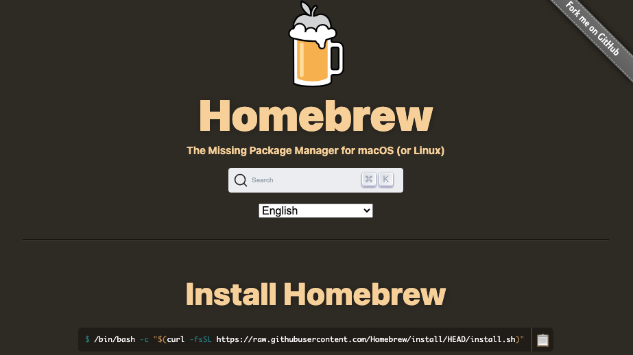
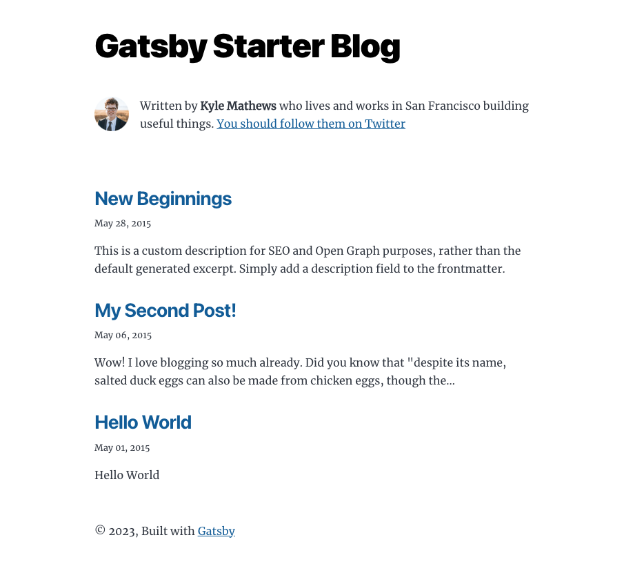

こんにちは、えむです！<br>
最近は少し忙しかったので、記事を更新できていませんでした。。。<br>
仕事でもCSSやHTMLを触りまくる期間だったので、プライベートでも触るのはきついっていうのもありましたが笑<br>
<br>
その状況でも最低限やれることはやっていて、ある程度スマホでも見られるようなデザインに調整することができました。
これもなかなか沼ってしまいました。CSSはいろんな書き方ができ、正解がないのでそれが逆に難しく感じます。<br>
<br>
何はともあれ、スマホからアクセスした人にも見てもらえるようになったので、前の記事でもいった通りGatsbyを用いたブログの作成方法について書いていきます。
本記事では、Gatsbyの開発環境を整えるところまで書きます。<br>
<br>
その前に、そのGatsbyってなんぞやって思う方もいると思います。一応言っておくと、ワックスを作っている会社のことではないです()<br>
<br>
そこで、かなり噛み砕いて説明してみます（自分なりの解釈なので、厳密な定義とかがしりたいなら自分で調べて学習することをお勧めします）。<br>
<br>
## Gatsbyって何？
GatsbyはHTMLでできた静的なwebサイトを作るものです（静的サイトジェネレータといいます）。<br>
オープンソースフレームワークなので、誰でも利用することができます。<br>
<br>
静的なwebサイトは、ビルドされた際に全てのHTMLファイルが全て用意され、ブラウザからアクセスがあると用意されたHTMLのページを表示するだけで良い、というイメージです。<br>
<br>
それの何がいいのってことなんですが、その比較としてCMS（コンテンツ管理システム。Word Pressが代表例）で作られたサイトがどのように表示されるかを知っておく必要があります。<br>
CMSで構築されたサイトはアクセスがあった際、サーバ上にあるデータベースにアクセスし、そのデータを元にHTMLが生成されます。それがレスポンスとして返ってきて表示されるという動きをします。<br>
これは動的にサイトに作られている、ということになります。<br>
<br>
料理屋に例えると、静的サイトはメニューにある料理を全て事前に作っておき、あとは提供するだけでよくて、それに対して動的サイトは注文があったら料理を開始して提供する、という違いになると思います。<br>
ですので、静的サイトの方が表示されるまでが早いということですね。<br>
もっと色々な違いがあり、長所短所あると思いますが、現時点で僕が説明できるのはこのくらいです。<br>


## Gatsbyの開発環境を整える手順
では、いよいよGatsbyでの開発環境の構築が必要です。大まかには以下の4つの手順を踏む必要があります。<br>

1. homebrewのインストール
2. nodebrewのインストール
3. node.js(npm)のインストール
4. Gatsby CLIのインストール

### １.homebrewのインストール
homebrewとはパッケージ管理システムです。<br>
対応OSはmacOS、Linuxとなっているので、Windowsの方は別のパッケージ管理システムを用いる必要があるかもしれません。<br>
homebrewのインストールは非常に簡単です。
[homebrew公式サイト](https://brew.sh/)にアクセスして、以下のコードをコピペしてターミナルで実行するだけです。


```
/bin/bash -c "$(curl -fsSL https://raw.githubusercontent.com/Homebrew/install/HEAD/install.sh)"
```
### ２.nodebrewのインストール
次に、１.でインストールしたhomebrewを使ってnodebrewをインストールします。<br>
nodebrewはNode.jsのバージョンを管理するものです。実はhomebrewからNode.jsを直接インストールすることも可能ですが、Node.jsのバージョンを切り替えたいとき、nodebrewでNode.jsを管理していた方が楽なのです。<br>
<br>
よくわからない人は、脳死でhomebrewの中にnodebrewをインストールして、そのnodebrewの中でNode.jsを管理すればいいんだ、ということだけ抑えていれば問題ないと思います。<br>

先ほどと同様にターミナルを開いて、以下のコマンドを実行すればインストールできます。<br>
```
brew install nodebrew
```
次に、以下のコマンドを用いてバージョンとインストールが完了していることを確認することができます。
```
nodebrew -v
```
### ３.Node.jsのインストール
次に、２.でインストールしたnodebrewを使ってNode.jsをインストールします。<br>
まず、以下のコマンドをターミナルで実行してインストールが可能なNode.jsのバージョンを確認します。<br>
```
nodebrew ls-remote
```
僕の環境では、v18.0.0を使っています。<br>
どのバージョンを使えばいいかわからない人は、一旦最新版でインストールしていいと思います。あとで、どのバージョンがいいかわかれば切り替えればいいだけですので。Gatsbyをインストールするときに、うまくいかなければどのバージョンが必要かの指示がコメントで出てくると思います。（確か）<br>
<br>
最新版のインストールは以下のコマンドをターミナルで実行します。<br>
```
nodebrew install-binary latest
```
次のコマンドでnodebrewでインストールしたNode.jsのバージョンを確認することができます。<br>
```
nodebrew ls
```
僕の環境では以下のように結果が出ます。<br>
```
nodebrew ls
v14.15.5
v18.0.0
```
そして、インストールされているバージョンから使いたいものを指定します。以下のコマンドをターミナルで実行します。今回はv18.0.0を使いたい場合の例です。<br>
```
nodebrew use v18.0.0
```
次にNode.jsを実行できるようにパスを通します。ターミナルがbashで起動しているか、zshで起動しているかで実行するコマンドが異なるようです。<br>
・bashの場合<br>
```
echo 'export PATH=$HOME/.nodebrew/current/bin:$PATH' >> ~/.bashrc
```
・zshの場合<br>
```
echo 'export PATH=$HOME/.nodebrew/current/bin:$PATH' >> ~/.zshrc
```
そして、以下のコマンドでnodeとnpmのバージョンが表示されれば、Node.jsのインストールは完了です。<br>
```
node -v
npm -v
```
npmはNode.jsのインストールと同時にインストールされるもので、プロジェクト内でパッケージを管理するシステムみたいです。<br>
ここに関して、あまり深く理解はできていませんが、Gatsbyのプロジェクトを作るときに初期化をしたり、実行するときに役立ってるものと解釈してます。<br>

### 4.Gatsby.jsのインストール
そして、最後にGatsby CLIのインストールを行います。<br>
Gatsby CLIはGatsbyサイトの初期化、ビルド、開発に使用するツールです。<br>
これを駆使すれば、Gatsbyでのwebサイトの開発が可能になります。
[Gatsby](https://brew.sh/)にインストールの仕方とプロジェクトの作り方が書かれています。<br>
<br>
Gatsby CLIのインストールは以下のコマンドをターミナルで実行します。
```
npm install -g gatsby-cli
```
これで、Gatsbyを利用する準備が整いました。<br>
<br>
実際にプロジェクトを作って起動するところまでやってみましょう。<br>
<br>
まず、任意のディレクトリ（フォルダのことです）を作成します。そして、ターミナルで`cd`コマンドを使って、作成したディレクトリの中に移動し、以下のコマンドを実行します。<br>
```
gatsby new my-new-blog https://github.com/gatsbyjs/gatsby-starter-blog
```
`gatsby new`はカレントディレクトリ（現在いるディレクトリ）の中に、gatsbyのプロジェクトを作成するコマンドで、その次の`my-new-blog`はプロジェクトの名前、最後のURL部分はGatsby.jsのどのスターターを使うかを指定するもの、になっています。<br>
最後の部分で指定するスターターは[Gatsbyスターター](https://www.gatsbyjs.com/starters/)の中から探して指定することができます。<br>
<br>
次に、`ls`コマンドを実行すると、カレントディレクトリの中に、先ほど作成したプロジェクト`my-new-blog`が作成されていることが確認できると思います。
```
ls
my-new-blog
```
`cd`コマンドで、my-new-blogの中に移動します。その後、`npm run develop`コマンドを実行すると、下記のように色々メッセーが出てきて、開発用のサーバをローカルで起動することができます。<br>
```
npm run develop

> gatsby-starter-blog@0.1.0 develop
> gatsby develop

success compile gatsby files - 0.534s
success load gatsby config - 0.043s
success load plugins - 1.614s
success onPreInit - 0.006s
success initialize cache - 0.121s
success copy gatsby files - 0.279s
success Compiling Gatsby Functions - 0.471s
success onPreBootstrap - 0.500s
success createSchemaCustomization - 0.013s
success Checking for changed pages - 0.001s
success source and transform nodes - 0.309s
success building schema - 0.288s
success createPages - 0.071s
success createPagesStatefully - 0.114s
info Total nodes: 63, SitePage nodes: 8 (use --verbose for breakdown)
success Checking for changed pages - 0.001s
success write out redirect data - 0.010s
success Build manifest and related icons - 0.159s
success onPostBootstrap - 0.170s
info bootstrap finished - 7.726s
success onPreExtractQueries - 0.001s
success extract queries from components - 2.224s
success write out requires - 0.006s
success Running gatsby-plugin-sharp.IMAGE_PROCESSING jobs - 0.387s - 4/4 10.34/s
⠀
You can now view gatsby-starter-blog in the browser.
⠀
  http://localhost:8000/
⠀
View GraphiQL, an in-browser IDE, to explore your site's data and schema
⠀
  http://localhost:8000/___graphql
⠀
Note that the development build is not optimized.
To create a production build, use gatsby build
⠀
success Building development bundle - 12.755s
success Writing page-data.json and slice-data.json files to public directory - 0.126s - 3/8 63.26/s
```
起動できたら、http://localhost:8000/ にアクセスしてみてください。これはローカルでサーバが起動しているときにのみアクセスできるURLです。<br>
下のような画面が表示されれば(画像サイズあとで調整します。。。)、テンプレートが上手く動き開発環境が整った、ということになります。

あとは、作成したプロジェクト内のコードを色々編集して、自分好みのwebサイトに作り替えていけばいいわけです！

## まとめ
今回はGatsbyが使える環境を整え、スターターを動かすところまで書きました。<br>
わかりにくいところがあったかもしれませんが、読んでいただきありがとうございました。<br>

次からは、実際にプロジェクト内のどこをどう編集していけばいいかを少しずつ書いていければと思います。<br>

ではでは〜〜
