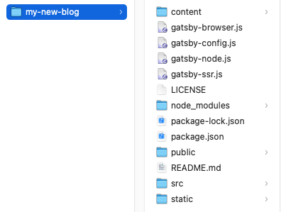
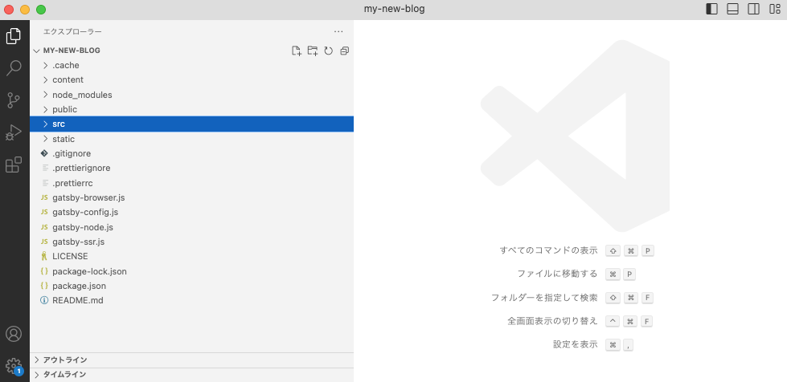
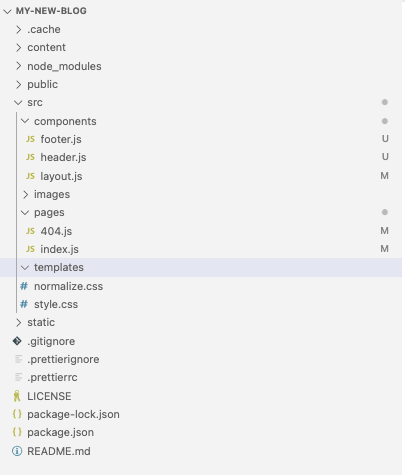
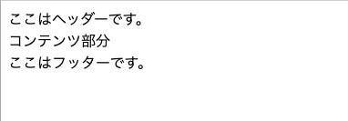

こんにちは、えむです！<br>
Gatsbyの開発環境は整いましたでしょうか？

今回からは実際にコードを書いて自作ブログを作っていく方法を書きたいと思います。

## プロジェクトをエディタで開く
まずは、前回作成したGatsbyプロジェクトを開いてください。どんなエディタでも構いません。<br>
下の図でいうと、`my-new-blog`が前回作成したGatsbyプロジェクトですのでそれを開きます。

開いて以下のようになっていればOKです。（VSCodeの場合）

ちなみに、これから主に触っていくのは`src`フォルダの中身になります。
前回、プロジェクト作成時に`gatsby-starter-blogを選択`した人は`src`フォルダの構成としては以下のようになっているはずです。
```
src
  |-- components
  |-- images
  |-- pages
  |-- templates
  |-- normalize.css
  |-- style.css
```
これらのフォルダの役割は以下の通りです。<br>
* components<br>
  ブログの共通部を部品として作っておく場所。例えば、ヘッダーやフッターをこのフォルダ内で作っておき、使いたい場所で呼び出す形にする。<br>
* images<br>
  ページ内で使う画像を入れておく場所。<br>
* pages<br>
  このフォルダの直下のjsファイルが、実際に表示されるページになる。`npm run develop`を実行した状態で、http://localhost:8000/ にアクセスすると`index.js`の中身が表示される。<br>
  また、この中に`post`フォルダを作り、さらにその中に`sample.js`というファイルを作れば、http://localhost:8000/post/sample でそのファイルの中身が表示される。
  `pages`がルードディレクトリになるイメージ。
* templates<br>
  その名の通り、テンプレートを置いておく場所。新たに記事を作るとき、デザインが同じなのに毎回`pages`にjsファイルを作っていくのは冗長だし大変。
  そこで、テンプレートを作っておき、mdファイルに記事の内容だけ書けば自動でページが生成されるようにしておくことができる。<br>この辺までできれば、記事の更新はかなり楽になる。<br>

`normalize.css`と`style.css`はただの装飾なので、必要なければ決して構いません。
## ヘッダーとフッターを作成する
では、実際に作り替えていく前に、1から作っていきたいので既存のファイルとかは一旦消します。
簡単なものを1から実装していく方が身につくと思います。<br>
`src`フォルダの外にある`gatsby-config.js`や`gatsby-node.js`などの`gatsby-〇〇.js`系は全部消して大丈夫です。
いろんな設定が書かれてますが、難しい内容になりますので。
`components`・`images`・`templates`の中のjsファイルも全て消してください。`pages`の中の`index.js`と`404.js`は残しておいてください。あとから内容は書き換えます。<br>
<br>
これで、1から書いていく準備ができました。もし、`npm run develop`をした時にエラーが出る場合は、エラー内容を見て不必要そうなファイルを消してみてください。<br>
消したあとは以下の構成になっています。

<br>
ブログは大体、ヘッダー・コンテンツ・サイドバー・フッターは全ページ共通でできており、コンテンツの中の記事だけが異なる、というパターンが多いと思います。
今回は、ヘッダー・フッターの部分をパーツ化してみます。<br>
<br>
まずは、`commponents`の中を触ります。`commponents`の中に、`header.js`と`footer.js`、そして`layout.js`というファイルを新規で作成してください。
そして、それぞれのファイルの内容を以下のように書いてみてください。<br>
### ・`header.js`<br>
  `import * as React from 'react'`はReactを使えるようにするおまじないみたいなものだと思ってください。<br>
  `const Header〜〜`で部品を定義していて、`return`の中に書いたものが、`export default Header`によって、`Header`という名前の部品になったイメージです。
```
import * as React from 'react';

const Header = () => {

  return (
    <header>
        ここはヘッダーです。
    </header>
  );
};

export default Header;
```
### ・`footer.js`
```
import * as React from 'react';

const Footer = () => {
  return (
    <footer>
      ここはフッターです。
    </footer>
  );
};

export default Footer;
```
### ・`layout.js`<br>
`import Header from './header'`と`import Footer from './footer'`で`Header`という部品と、`Footer`という部品が使えるようになります。
この部品は`<Header/>`と`<Footer/>`という形で使うことができます。<br>
`header.js`と`footer.js`と違い、`const Layout = ({ children })`というようにchildrenという変数を入れています。 
これは`Layout`を部品として使うとき、`<Layout>任意の文字</Layout>`という形で使うことで、childrenが`任意の文字`に置き換わります。
つまり`<Layout></Layout>`で囲った文字はヘッダーとフッターで囲まれる形で表示されるわけです。後の`index.js`でこの書き方をします。<br>

```
import * as React from 'react';
import Header from './header';
import Footer from './footer';

const Layout = ({ children }) => {
  return (
    <>
      <Header />
      { children }
      <Footer />
    </>

  );
};

export default Layout;
```


では、この段階でどのように表示されるか確認してみましょう。

`index.js`と`404.js`をそれぞれ以下の内容に書き換えてください。<br>

### ・`index.js`<br>
```
import * as React from 'react';
import Layout from '../components/layout';

const IndexPage = () => {
  return (
    <Layout>
      コンテンツ部分
    </Layout>
    
  );
};

export default IndexPage;
```
### ・`404.js`<br>
```
import * as React from 'react';

const NotFound = () => {
  return <p>アクセスしたページは存在しません。</p>;
};

export default NotFound;
```

`npm run develop`を実行して、http://localhost:8000/ にアクセスすると以下のような画面が表示されます。

`index.js`ではコンテンツ部分という文字しか入れていないのにも関わらず、ヘッダー・フッターで設定した文字が表示されており、無事パーツ化されていることがわかります。<br>
これだけでは少しわかりにくいので、少しデザインを変更してみましょう。
（後日書きます、少しお待ちを）

## まとめ
今回は、実際にファイルを編集してヘッダーとフッターの部品かをすることができました。<br>
デザイン部分はかなり適当に書いています。ていうのも、CSSは試行錯誤して自分で書いていった方が絶対にいいからです。
CSSの書き方を調べてオリジナルのものを作ってみてください。<br>
あとはコンテンツ部をどう書いていくか、というところがこれからの目標になります。<br>

ではでは〜〜
